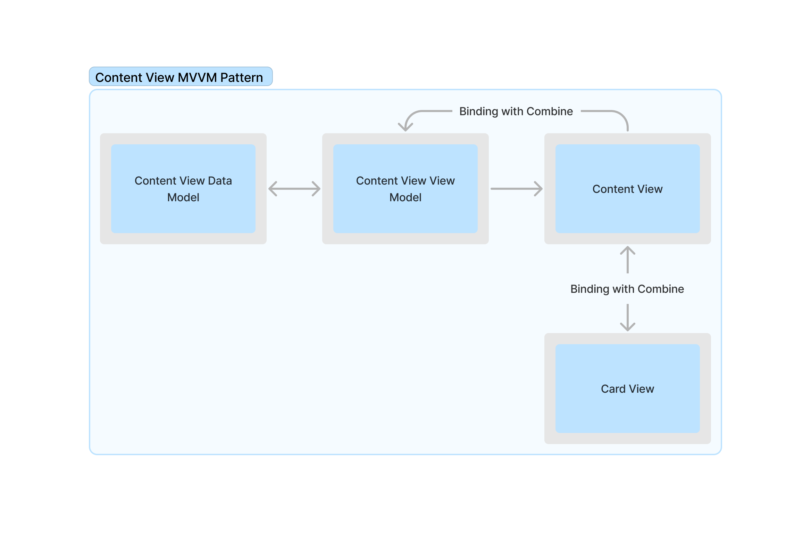
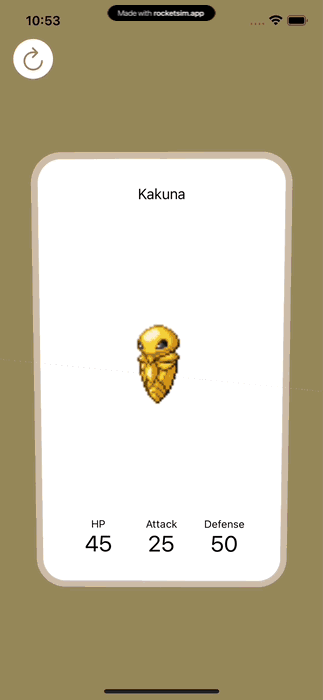
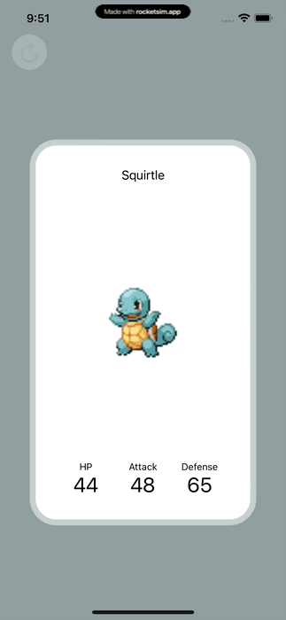
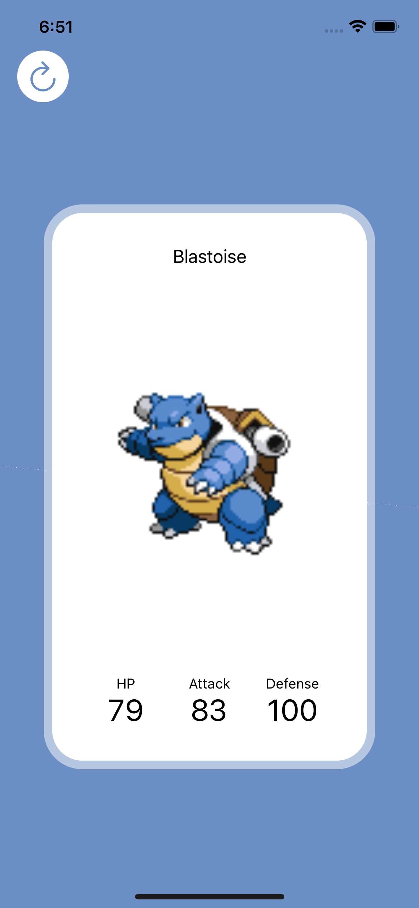
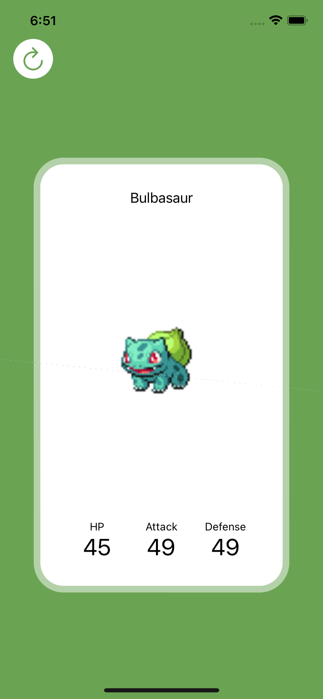
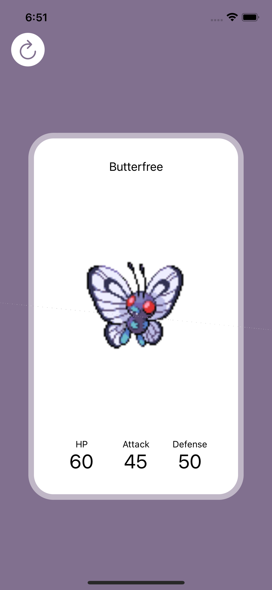
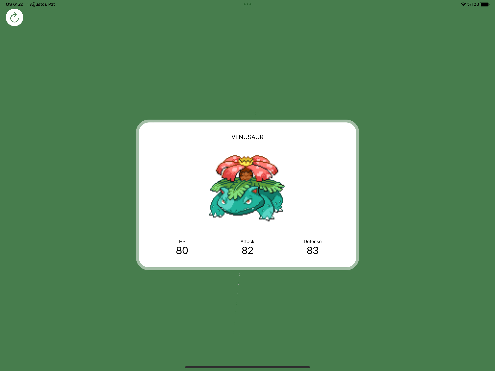

## Abstract

In this application Pokemon data from PokeAPI is fetched and displayed for every available Pokemon. Name, attack, defense, health and thumbnail datas are presented on a card view with flip animtaions; users can iterate through tapping on cards and press reset button to return to the first Pokemon on the API.

✅  SwiftUI
✅  Combine
✅  Async Image downloading.
✅  MVVM Pattern
✅  CoreGraphics calculations.
✅  Custom animations.
✅  Resusable views.
✅  iPadOS and iOS support with Size Class.

## Running Project

Application is in Swift Package format, which is a format that used by Apple for contests. Application developed on Xcode 14 Beta and tested on iOS 16 but application should work on iOS 15 as well. After cloning this repository "swiftpm" file can be open through Xcode and can run and be previewed as a regular Xcode project, only difference is there is no file structure so "swift" files are in one folder. Project doesn't requires a lot of files so I tought that this shouldn't be a problem.

## Method

### API Calls
Pokemon data is fetched as pages, a prequery is fetched from "https://pokeapi.co/api/v2/pokemon/?offset=\(20*pageNum)&limit=20" link; "pageNum" variable represents the page number that app is currently on, page number is multiplied with 20 to give offset to the API. Prequery contains data link and name of 20 Pokemons. Given links are used to fetch attack, defense, health, name and image data of the Pokemon. Every processed Pokemon is poped from the array and if the array is empty page number increased by one and prequery fetched from the API again.

Front face and back face data of the Card View are stored in memory, when a faces turns back new data fetched from API to make card flip more responsive. Card data is Published and observed by Content View.

### Content View

MVVM is implemented as design pattern. Application contains Content View as only page view. API logic handled with Data Model and data proccessing handeled on View Model that owned by Content View. Content View displays Card View and binds data to it.

 

Contents in Content View layouted with SwiftUI and made dynamic for any size with GeometryReader. Animation and UI logics are handled on Content View. Content View stores degree, offset and flipCount of the Card. Users can tap on card view and make card flip to the other face. While other face is on the back, new information for the face is fetched. An lock is put on the TapGesture to prevent users flip card before flip animation is completed.

#### Flip Animation

Flip animation achived with "rotation3DEffect" of the SwiftUI. Front and back face of the Card are represented as indivisual view. For first flip front view y rotation degree is set to 89.9 (this value is to prevent warning by SwiftUI) views 2D nature makes it invisible at 90 degrees and after front view animation is completed, degree of back view is setted to 0 degree. For the second flip vice versa happens for the both view. To achive damping and wiggle on the animation I have used "interpolatingSpring" while setting card degrees to 0.

<p align="center">
    
</p>

#### Reset Animation

Reset animation done with "interpolatingSpring" on y offset of the card views. When Reset button pressed image y offset is increased as much as device height and it decreased to after half second.

<p align="center">
    
</p>

#### Dynamic Background and Downloading Images

Pokemon data contains a URL that store sprite data in "png" format. This data is fetched with URLRequest and stored in the memory. When imageData is updated, data is published to the Content View with "onRecive" method. Image data setted to corresponding side of the card. An UIImage is generated from sprite data, SwiftUI image is generated and displayed via UIImage then Average color on the UIImage is calculated to update background color according to sprite image. 

On UIImage a extention is added to UIImage class for the calculation of the average color on image. UIImage data is converted to CIImage format. A sample frame from CIImage taken as an extentVector in given dimensions and coordinate on the sample code. Then "CIAreaAverage" filter is applied on the given image with extentVector. A bitmap created from filtered image and r, b, g and a data of the bitmap is used to convert to UIColor. Background color is stored on the memory and when new image is setted, background color is transitions to new color with linear animation.

```swift
let extentVector = CIVector(x: inputImage.extent.size.width / 2,
                            y: inputImage.extent.size.height / 2,
                            z: inputImage.extent.size.width / 8,
                            w: inputImage.extent.size.height / 8)
```
<p align="center">
   
    
    
</p>

## iPad Support

Diffrent devices sizes are adepted dynamicly with size classes. When horizontal size class is in regular mode, compact mode height and width values of Card View is switched to protect aspect ratio. Maximum width and height values are determined to adept to big screen size of iPad.

<p align="center">
    
</p>
